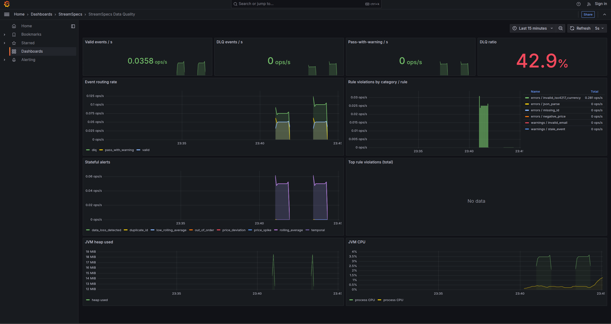

# StreamSpecs

Real-time **streaming data quality validator** for Apache Kafka, written in **Scala 3** with **Cats Effect 3** and **FS2** with Grafana dashboard.

Validates events *on the stream* (before they land in a warehouse), routes failures to a Dead Letter Queue, and raises stateful alerts (Dead Man's Switch + rolling average).

```
                  ┌──────────────┐
                  │  Kafka Topic │     incoming steaming events
                  └──────┬───────┘
                         │
                         ▼
             ┌───────────────────────┐
             │   StreamSpecs Engine  │ <--- HOCON rules
             │   (FS2 + Cats Effect) │
             └───────────┬───────────┘
                         │
        ┌────────────────┴────────────────┐
        │ Valid / Pass-with-warn      DLQ │
        ▼                                 ▼
┌──────────────┐                  ┌──────────────┐
│ valid-events │                  │  dlq-events  │
└──────────────┘                  └──────────────┘
```

## Features (MVP)

| Capability | Description |
|---|---|
| Declarative HOCON rules | Per error-code `metric-key` + `send-to-dlq` |
| Stateless validation | Required fields, numeric bounds, email regex, JSON parse |
| Allowed currency | Optional product allow-list (subset of ISO 4217) |
| ISO 4217 currency | Default: 3-letter alphabetic codes via JDK (`PLN`, `EUR`, …) |
| Freshness / lag | `eventTimestamp` vs wall clock (`max-lag`) |
| DLQ routing | Failed events wrapped with reason / error code / timestamp |
| Pass-with-warning | Soft failures still forward to the valid topic but bump a metric |
| Dead Man's Switch | Alert when the stream goes silent longer than `max-idle-duration` |
| Volume spike | Alert when too many events arrive in a sliding time window |
| Duplicate ID | Detect repeated ids within last N events (Kafka retries) |
| Rolling average | Count-based window over `price`; alert below threshold |
| Time-based rolling window | Mean over last `window-duration` (event-time or processing-time) |
| Price deviation | Spike vs rolling baseline (e.g. +150%) |
| Out-of-order timestamps | `eventTimestamp` going backwards |
| Simulation mode | Full pipeline demo **without** a Kafka broker |
| Prometheus metrics | `/metrics` scrape endpoint (default `:9464`) |
| Grafana dashboard | Provisioned template under `monitoring/grafana/` |

## Quick start (simulation - no Kafka)

Requires **JDK 17+** and **sbt**.

```bash
# if your default Java is older than 17:
./scripts/with-jdk17.sh sbt run

# or simply:
sbt run
```

You should see valid / DLQ / warning routing, a rolling-average alert, then a Dead Man's Switch alert during the intentional silence gap.

## Quick start (with Kafka)

```bash
docker compose up -d
# wait ~10s for topics

# in application.conf set: simulation-mode = false
# or override:
sbt -Dstream-validator.simulation-mode=false run

# in another terminal:
pip install kafka-python
python scripts/generate_events.py
```

## Metrics (Prometheus + Grafana)

StreamSpecs exposes Prometheus counters on **`:9464/metrics`** when the metrics HTTP server is enabled.

### Enable / disable metrics server

Precedence (highest wins): **CLI → environment → `application.conf`**

| Layer | Example |
|---|---|
| CLI | `sbt "run -- --no-metrics-server"` |
| CLI | `sbt "run -- --metrics-server --metrics-port 9100"` |
| ENV | `STREAMSPECS_METRICS_SERVER=false sbt run` |
| HOCON | `metrics.prometheus.enabled = false` |

```bash
# help
sbt "run -- --help"

# run without background scrape server (counters can still use console/silent backend)
sbt "run -- --no-metrics-server"

# custom port
sbt "run -- --metrics-server --metrics-port 9100"

# packaged binary
./stream-specs --no-metrics-server
./stream-specs --metrics-backend silent
```

| Metric | Labels | Meaning |
|---|---|---|
| `streamspecs_events_total` | `result`=`valid`\|`dlq`\|`pass_with_warning` | Routing outcome |
| `streamspecs_rule_violations_total` | `category`, `rule` | Stateless rule hits |
| `streamspecs_stateful_alerts_total` | `alert_type` | Windowed / temporal alerts |
| JVM (`jvm_*`, `process_*`) | - | Optional via `jvm-metrics = true` |

```bash
# start Prometheus + Grafana (+ Kafka)
docker compose up -d prometheus grafana

# run the validator (simulation still scrapable)
./scripts/with-jdk17.sh sbt run

# scrape locally
curl -s http://127.0.0.1:9464/metrics | grep streamspecs_

# Grafana: http://localhost:3000  (admin / streamspecs)
# Dashboard: "StreamSpecs Data Quality" (folder StreamSpecs)
# Prometheus UI: http://localhost:9090
```

#### Direct link to Grafana dashboard:

[http://localhost:3000/d/streamspecs-dq/streamspecs-data-quality?orgId=1&from=now-15m&to=now&timezone=browser&refresh=5s](http://localhost:3000/d/streamspecs-dq/streamspecs-data-quality?orgId=1&from=now-15m&to=now&timezone=browser&refresh=5s)

##### How it's looks like?




HOCON + env placeholders:

```hocon
metrics {
  backend = "prometheus"          # or STREAMSPECS_METRICS_BACKEND
  echo-to-console = true
  prometheus {
    enabled = true                # or STREAMSPECS_METRICS_SERVER
    host = "0.0.0.0"              # or STREAMSPECS_METRICS_HOST
    port = 9464                   # or STREAMSPECS_METRICS_PORT
    jvm-metrics = true
  }
}
```

Dashboard template: `monitoring/grafana/provisioning/dashboards/json/streamspecs-data-quality.json`

## Rule configuration

`src/main/resources/application.conf`:

```hocon
stream-validator {
  rules {
    missing-id {
      metric-key = "alerts.errors.missing_id"
      send-to-dlq = true
    }
    invalid-email-format {
      metric-key = "alerts.warnings.invalid_email"
      send-to-dlq = false   # metric only - event still forwarded
    }
  }

  stateful-rules {
    heartbeat-check {
      metric-key = "alerts.stateful.data_loss_detected"
      max-idle-duration = 3s
    }
    rolling-price-check {
      metric-key = "alerts.stateful.low_rolling_average"
      field = "price"
      window-size-events = 3
      min-allowed-average = 50.0
    }
  }
}
```

## Project layout

```
src/main/scala/com/streamspecs/
  StreamSpecsApp.scala          # entrypoint
  config/Config.scala           # PureConfig models
  domain/Models.scala           # events + ValidationOutcome + StatefulAlert
  validation/
    EventValidator.scala        # stateless (+ ISO 4217, freshness, allow-list)
    Iso4217.scala               # ISO 4217 alphabetic currency codes
    DuplicateIdValidator.scala
    VolumeSpikeDetector.scala
    RollingWindow.scala
    RollingAverageValidator.scala
    TimeRollingWindow.scala
    TimeRollingAverageValidator.scala
    PriceDeviationValidator.scala
    OutOfOrderValidator.scala
    DeadMansSwitch.scala
    StatefulPipe.scala          # compose stateful pipes
  pipeline/ValidationPipeline.scala
  kafka/KafkaIO.scala
  metrics/
    Metrics.scala
    PrometheusRegistry.scala
    PrometheusServer.scala
```

## Tests

```bash
sbt test
```

## CI (GitHub Actions)

On every push / PR to `main` (or `master`):

| Job | Command |
|---|---|
| Format | `sbt scalafmtCheckAll` |
| Compile | `sbt Test/compile` (with `-Werror`) |
| Test | `sbt test` |

Locally mirror CI with:

```bash
sbt ci          # fmtCheck + compile + test
sbt fmt         # rewrite sources with scalafmt
sbt fmtCheck    # check only
```

## Stack

- Scala 3.3
- Cats Effect 3
- FS2 3
- fs2-kafka
- Circe
- PureConfig
- Prometheus
- MUnit

## Roadmap

- [ ] Move codebase to more generic Scala library, where I need to put Kafka parameters and queues names, internally library do data quality job (we need to unify/independent /make generic/ domain data model in impl. - this need to be in "domain" user' code  package, not in our generic library)
- [ ] OpenTelemetry traces / exemplars
- [ ] Slack / webhook alerts from DLQ + stateful anomalies
- [ ] YAML rule packs + `include` composition
- [ ] Throughput benchmarks (events/s)

## License

MIT
