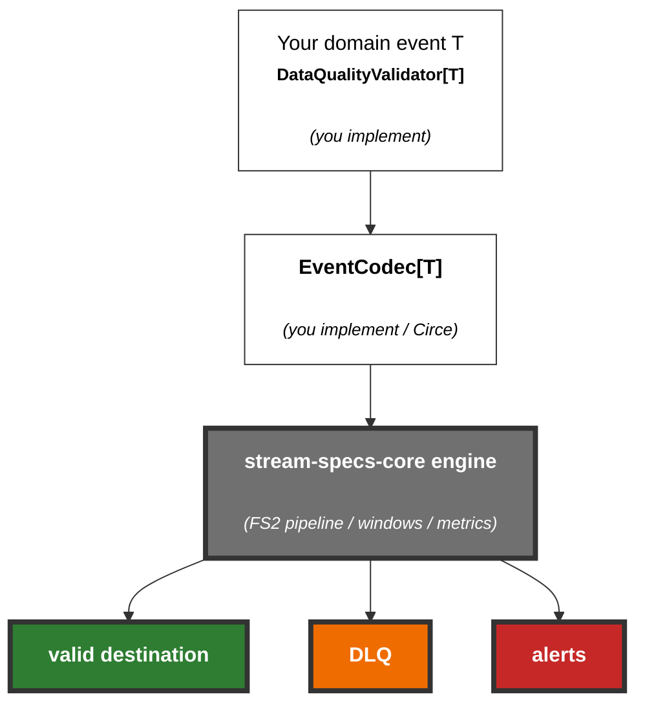

# StreamSpecs

**Universal streaming data-quality library** for Scala 3 / Cats Effect / FS2.

You define the domain type and rules. The library handles **Kafka or NATS JetStream** I/O, stateful windows, DLQ routing, and Prometheus metrics — without knowing your fields (`price`, `temperature`, …).



## Modules

| Module | Artifact | Role |
|---|---|---|
| `core` | `stream-specs-core` | Universal library (Kafka + NATS JetStream) |
| `examples` | `stream-specs-examples` | IoT + finance demos |

## Quick start (IoT example)

```bash
./scripts/with-jdk17.sh sbt "examples/run"
# or with metrics flags:
./scripts/with-jdk17.sh sbt "examples/run -- --no-metrics-server"
```

### Live broker modes

```bash
# Kafka
docker compose up -d kafka kafka-init
# application.conf: messaging.backend = kafka, simulation-mode = false
./scripts/with-jdk17.sh sbt "examples/run -- --messaging-backend=kafka"
python scripts/generate_iot_events.py

# NATS JetStream
docker compose up -d nats nats-init
# application.conf: messaging.backend = nats, simulation-mode = false
./scripts/with-jdk17.sh sbt "examples/run -- --messaging-backend=nats"
pip install nats-py
python scripts/generate_iot_events_nats.py
```

## Implement your domain

```scala
import com.streamspecs.core.*

final case class TemperatureSensorEvent(
  deviceId: String,
  temperature: Double,
  humidity: Double,
  timestamp: Long
)

object TemperatureSensorEvent:
  given EventCodec[TemperatureSensorEvent] = EventCodec.fromCirce // needs circe Codec

  given DataQualityValidator[TemperatureSensorEvent] with
    def extractId(e: TemperatureSensorEvent) = Some(e.deviceId)
    def extractTimestamp(e: TemperatureSensorEvent) = Some(e.timestamp)
    def extractMetricValue(e: TemperatureSensorEvent, name: String) =
      name match
        case "temperature" => Some(e.temperature)
        case "humidity"    => Some(e.humidity)
        case _             => None
    def statelessRules(e: TemperatureSensorEvent) = Map(
      "temperature-bound" -> (
        if e.temperature >= -50 && e.temperature <= 100 then RuleVerdict.Valid
        else RuleVerdict.Invalid(s"out of range: ${e.temperature}")
      )
    )
```

Wire the engine:

```scala
val engine = new ValidationEngine[TemperatureSensorEvent](config, metrics)
val (transform, watchdog) = engine.build(heartbeat, volumeState)
```

## HOCON (engine only)

Rule **logic** is in your `DataQualityValidator`. Config only sets routing, windows, and the service bus:

```hocon
stream-specs {
  messaging {
    backend = "kafka"   # or "nats"
    destinations {
      incoming = "incoming-sensors"
      valid = "valid-sensors"
      dlq = "sensors-dlq"
    }
    kafka { bootstrap-servers = "localhost:9092" /* ... */ }
    nats {
      servers = "nats://localhost:4222"
      stream = "SENSORS"
      durable = "stream-specs-iot"
      create-stream-if-missing = true
      deliver-policy = "all"
    }
  }
  rules {
    temperature-bound {
      metric-key = "alerts.errors.temperature_bound"
      send-to-dlq = true
    }
    humidity-bound {
      metric-key = "alerts.warnings.humidity_bound"
      send-to-dlq = false   # warning -> forward + metric
    }
  }
  stateful-rules {
    rolling-average-check {
      metric-name = "temperature"   # passed to extractMetricValue
      window-size-events = 5
      min-allowed-average = 15.0
      metric-key = "alerts.stateful.low_rolling_average"
    }
  }
}
```

CLI / env for messaging: `--messaging-backend=nats`, `STREAMSPECS_MESSAGING_BACKEND`.

## Built-in stateful checks

| Check | Uses |
|---|---|
| Dead Man's Switch | event arrival time |
| Volume spike | event rate |
| Duplicate ID | `extractId` |
| Out-of-order | `extractTimestamp` |
| Rolling average (count) | `extractMetricValue(metric-name)` |
| Time-rolling average | `extractMetricValue` + timestamp |
| Metric deviation | `extractMetricValue(metric-name)` |

## Metrics (Prometheus)

Default scrape: `http://localhost:9464/metrics`

```bash
docker compose up -d prometheus grafana
sbt "examples/run -- --metrics-server"
# Grafana: http://localhost:3000  (admin / streamspecs)
```

#### Direct link to Grafana dashboard:

[http://localhost:3000/d/streamspecs-dq/streamspecs-data-quality?orgId=1&from=now-15m&to=now&timezone=browser&refresh=5s](http://localhost:3000/d/streamspecs-dq/streamspecs-data-quality?orgId=1&from=now-15m&to=now&timezone=browser&refresh=5s)

##### How it's looks like?


CLI / env: `--no-metrics-server`, `STREAMSPECS_METRICS_SERVER`, … (see `--help`).

## Tests

```bash
sbt core/test
sbt examples/compile
```

## License

MIT
